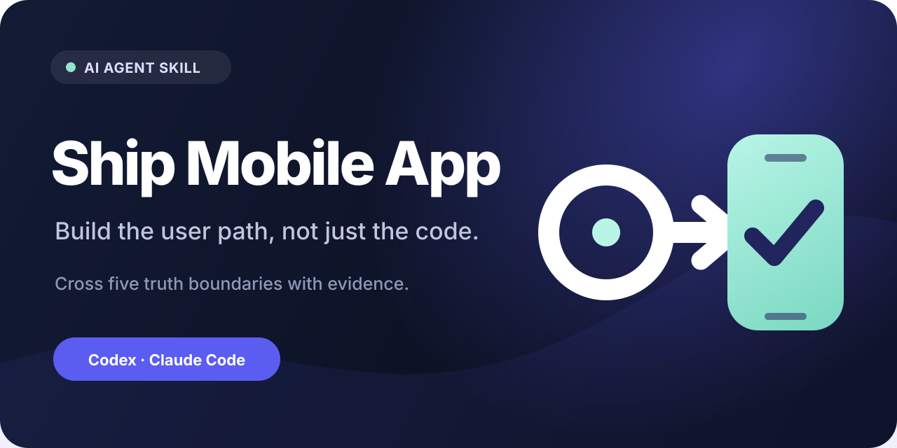

# Ship Mobile App

[한국어](README.ko.md)

[](https://skills.sh/aiopshwang/ship-mobile-app)



**Build the user path, not just the code.**

Ship Mobile App is an open, framework-neutral Agent Skill for Claude Code and
Codex. It helps coding agents build, debug, and prepare production mobile apps
across domain meaning, local and server state, offline behavior, lifecycle,
native configuration, signed artifacts, and truthful user-facing claims.

It supports Flutter, React Native, native iOS, and native Android without
prescribing one architecture.

## Install for Claude Code and Codex

Install in the current project:

```bash
npx skills add aiopshwang/ship-mobile-app --skill ship-mobile-app -a claude-code -a codex
```

Add `--global` to make it available across projects:

```bash
npx skills add aiopshwang/ship-mobile-app --skill ship-mobile-app --global -a claude-code -a codex
```

| Host | Explicit invocation | Project location |
|---|---|---|
| Claude Code | `/ship-mobile-app` | `.claude/skills/ship-mobile-app` |
| Codex | `$ship-mobile-app` | `.agents/skills/ship-mobile-app` |

Example request:

```text
Use Ship Mobile App to implement this offline save flow and verify account
switching, cold start, and the signed release build.
```

Both hosts may also select the skill automatically when the task matches its
description. The package follows the open Agent Skills format supported by
[Claude Code](https://code.claude.com/docs/en/skills) and
[Codex](https://learn.chatgpt.com/docs/build-skills).

## The five truth boundaries

| Boundary | Question |
|---|---|
| Domain | Does the data mean what the label and behavior claim? |
| State | Are optimistic, queued, committed, stale, and failed states distinguishable? |
| Lifecycle | Does it survive cold start, resume, background, permissions, and account transitions? |
| Platform | Does the exact signed artifact contain the required configuration? |
| Claim | Do UI, AI, privacy, and release claims match what was actually observed? |

The skill traces the real path:

```text
user action -> UI -> domain logic -> persistence/sync
            -> native or external service -> signed artifact -> user result
```

It selects only the boundaries touched by the request instead of turning every
change into a release project.

## Use it for

- non-trivial mobile features that cross UI, storage, backend, or native layers;
- offline writes, synchronization, stale state, and account switching;
- auth, deep links, notifications, background work, widgets, permissions, or AI;
- bugs that appear only under real geometry, lifecycle, release, or device state;
- release-candidate preparation and evidence-backed store delivery.

Skip it for isolated snippets, simple visual styling, web- or server-only work,
open-ended app ideation, or store marketing copy by itself.

## What is inside

```text
skills/ship-mobile-app/
├── SKILL.md
├── agents/openai.yaml
└── references/
    ├── boundary-checks.md
    ├── failure-patterns.md
    └── verification-ladders.md
```

- `SKILL.md` contains the compact operating method.
- `boundary-checks.md` covers time, state, identity, lifecycle, native, AI, and
  operational contracts.
- `verification-ladders.md` separates source, tests, artifacts, devices, and
  remote state.
- `failure-patterns.md` contains anonymized synthetic diagnostics derived from
  recurring real-world failure shapes.

## Evidence and limitations

`0.1.0` is an initial public preview. The package passed structural validation,
cross-host installation checks, and independent synthetic evaluations. See
[EVALS.md](EVALS.md) for the observed outcomes and untested boundaries.

These checks do not establish universal productivity, correctness, or app success
across every agent, framework, device, backend, or store.

## Relationship to Goal to Proof

The two skills are complementary and independent:

- **Ship Mobile App** provides mobile-specific development and diagnostic method.
- **Goal to Proof** provides a domain-neutral completion gate.

Neither requires the other.

## Origin, privacy, and security

The method was distilled from recurring failure shapes encountered while shipping
and operating a real cross-platform consumer app. The repository contains no raw
conversations, private source code, user data, credentials, internal paths, or
project-specific operational identifiers. Examples are synthetic and generalized.

See [PRIVACY.md](PRIVACY.md) and [SECURITY.md](SECURITY.md). To report a
reproducible false trigger or missing mobile boundary, open a GitHub issue. Use
private vulnerability reporting for security-sensitive findings.

## aiopshwang skill family

Independent, evidence-first Agent Skills that work well together:

- [goal-to-proof](https://github.com/aiopshwang/goal-to-proof) — the general completion gate: finish authorized work and prove the requested outcome.
- [verify-regression-tests](https://github.com/aiopshwang/verify-regression-tests) — prove that a regression test actually detects its intended defect.
- [data-analysis-ml-agent-skills](https://github.com/aiopshwang/data-analysis-ml-agent-skills) — decision-grade data analysis and ML: audits, leakage-safe experiments, validation, reproducible handoff.

## License

MIT © `aiopshwang`.
